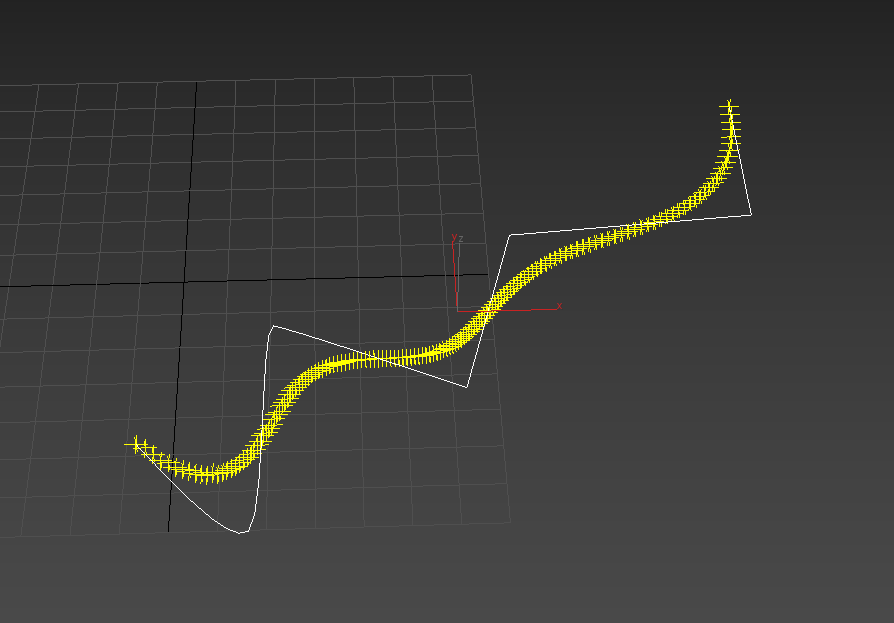

# MaxBSpline

This is a quick script that generates BSpline knots based on a normal 3ds max spline. 
You can take it from there.

Some of the code is based on: https://github.com/PikminGuts92/BSpliner/

